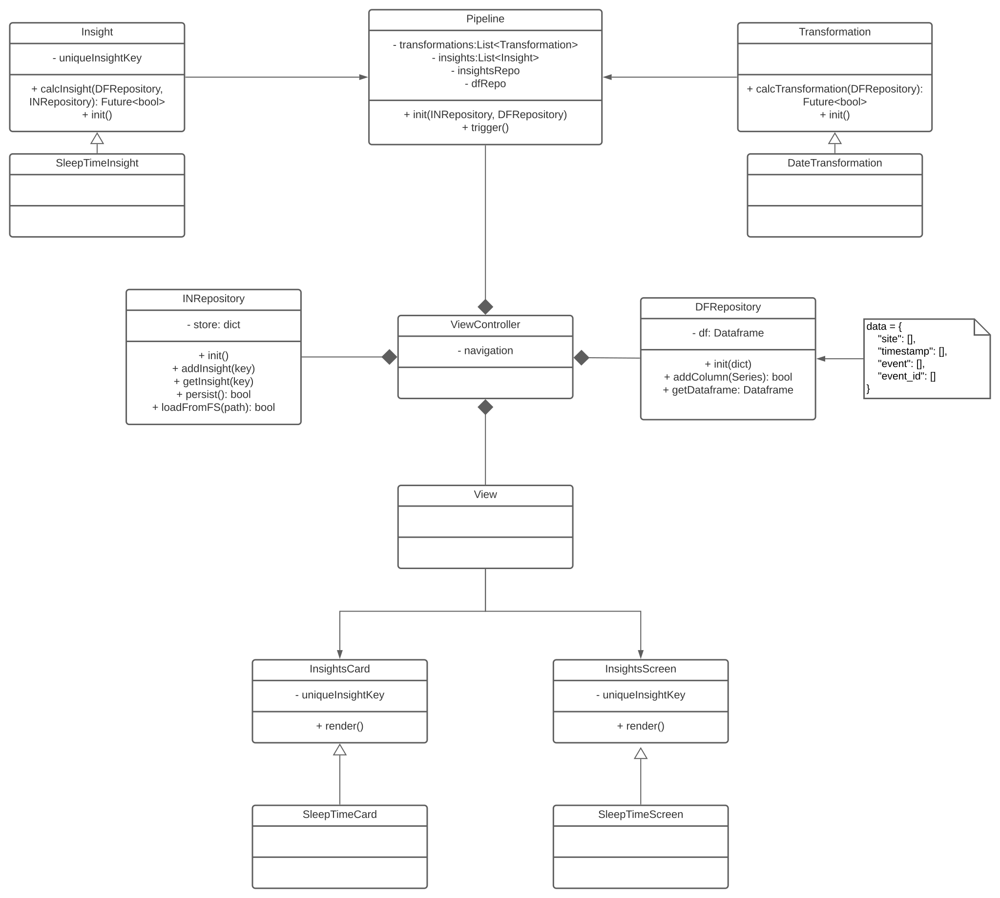

# Architecture

The architecture makes the fundamental assumption, that the app should be able to make inferences based on the user-supplied data.
This leads to the idea of a feature engineering and insight generation or aggregation operation flow. Both of those activities are organised in a pipeline, that runs once on data loading and persists all results for later access.

At the core of this pipeline is the repository pattern with two seperate repositories. One for the raw dataframe and one simplifying data access and persistence for the results.

In this architecture there are two fundamendtal types of operations in the pipeline, which each can only write to one of the repositories.

## Transformations
Transformations are basically feature engineering steps, where data is parsed and augmented. This can be used for everything where a new column would be added to the base dataframe.

A transformation must inherit from `Transformation` and should be registred in the pipeline in order to run.

## Insights
Insights are aggregations on the data or other user facing analysis, like inferences on sleep time or similar behavioural analysis.

A insights must inherit from `Insight`.

Insights have a `insightKey` which is used to write and later access results of the computation from the Insight Repository. This should be consistent across all UI and computational elements.

## Registering new Insights and Transformations

A new insight should be instantiated in the `pipeline.dart` and then added to the list of insights/transformations, which are executed.
If a new transformation depends on a previous transformation it should be added at the end of the list. Otherwise the order does not matter.